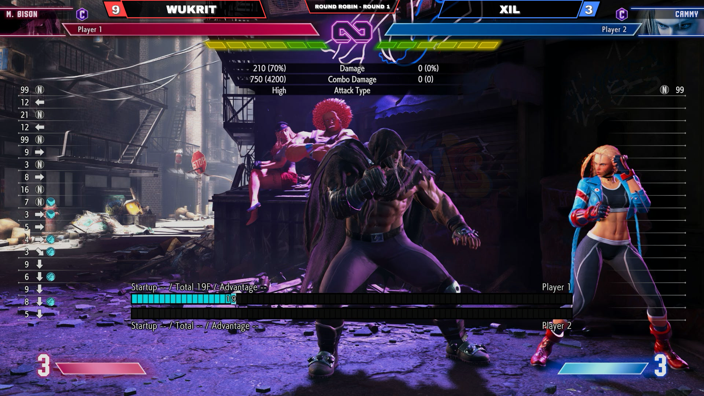

# FGC Scoreboard

> Forked from [WASD-Gaming/fgc-scoreboard](https://github.com/WASD-Gaming/fgc-scoreboard) by [@tarikfayad](https://twitter.com/tarikfayad). Big thanks to Tarik for the original project — check out his work at [WASD Gaming](https://wasdgaming.gg).

FGC Scoreboard is an HTML and CSS scoreboard overlay for fighting game tournament streams. It uses no images for the scoreboard itself (only optional tournament logos) and no webm files for animations — everything is CSS keyframes and GreenSock (TweenMax).

## Quick Start

There are two ways to use FGC Scoreboard: **LAN mode** (recommended for tournaments) and **Remote mode** (for online setups).

### LAN Mode (No Internet Required)

Best for in-person tournaments. Requires Python 3.

1. Run the server from the project directory:
   ```
   python3 server.py
   ```
2. The server prints your LAN URLs:
   ```
   FGC Scoreboard Server
   Controller: http://192.168.1.5:8080/controller.html
   Overlay:    http://192.168.1.5:8080/_overlays/scoreboard.html
   ```
3. Open the **Controller** URL on your phone or tablet.
4. In OBS, add a **Browser Source** pointing to the **Overlay** URL. Set the resolution to **1920x1080**.
5. Enter scores on the controller, hit **Save**, and the overlay updates live.

To use a different port: `python3 server.py --port 9090`

### Tunnel Mode (Cloudflare Tunnel)

Best for sharing your local server over the internet with a stable URL. Requires [cloudflared](https://developers.cloudflare.com/cloudflare-one/connections/connect-networks/get-started/).

> **Note:** The LAN server has no authentication. Anyone with your tunnel URL can read and overwrite the scoreboard. Only share the URL with trusted operators.

**One-time setup:**

1. Install cloudflared:
   ```
   brew install cloudflared
   ```
2. Login to your Cloudflare account:
   ```
   cloudflared tunnel login
   ```
3. Create a named tunnel:
   ```
   cloudflared tunnel create fgc-scoreboard
   ```
4. Create a config file at `~/.cloudflared/config.yml`:
   ```yaml
   tunnel: fgc-scoreboard
   credentials-file: /path/to/.cloudflared/<TUNNEL_ID>.json

   ingress:
     - hostname: fgc.yourdomain.com
       service: http://localhost:8080
     - service: http_status:404
   ```
   Replace `<TUNNEL_ID>` with the ID printed from step 3, and `fgc.yourdomain.com` with your subdomain.
5. Create the DNS record:
   ```
   cloudflared tunnel route dns fgc-scoreboard fgc.yourdomain.com
   ```

**Running:**

```
./start-tunnel.sh
```

This starts both `server.py` and the Cloudflare Tunnel. Your URLs will be:
- **Controller:** `https://fgc.yourdomain.com/controller.html`
- **Overlay:** `https://fgc.yourdomain.com/_overlays/scoreboard.html`

Press Ctrl+C to stop both.

### Remote Mode (Internet Required)

Best for online tournaments or when the controller and streaming PC aren't on the same network.

> **Note:** npoint.io bins are public. Anyone who knows or guesses your bin ID can read or overwrite the scoreboard. For high-stakes tournaments, prefer LAN or Tunnel mode.

1. Create a free JSON bin at [npoint.io](https://www.npoint.io/) and copy the bin ID.
2. In OBS, add a **Browser Source** (1920x1080) pointing to:
   ```
   https://yourgithubpages.url/_overlays/scoreboard.html?bin=YOUR_BIN_ID
   ```
3. Open the controller with the same bin ID:
   ```
   https://yourgithubpages.url/controller.html?bin=YOUR_BIN_ID
   ```
4. Enter scores on the controller, hit **Save**, and the overlay polls for updates every second.

## The Controller

The controller is a mobile-friendly web form for updating:
- Player Names
- Team Names
- Scores (tap +/- buttons, which auto-save instantly)
- Round
- Game

It also has **Swap** (switch player sides), **Reset** (zero out scores), and **Clear** (wipe all fields) buttons.

## Supported Games

When you select a game and hit save, the overlay adjusts its position so scores and logos don't cover important in-game gauges (HP bars, meters, etc.).

| Game | Layout |
|------|--------|
| BBTAG, SFVCE, TEKKEN7, UNICLR | Shifted down |
| BBCF, DBFZ, GGXRD, KOFXIV, MVCI, SF6, UMVC3 | Default |
| USF4 | Custom offset |

### Adding a New Game

1. Add the game to the datalist in `controller.html`.
2. Add the game to the appropriate group in the `GAME_GROUPS` object at the top of `_overlays/js/scoreboard.js`:
   ```javascript
   var GAME_GROUPS = {
       adjust1: ['BBTAG', 'SFVCE', 'TEKKEN7', 'UNICLR'],
       adjust2: ['BBCF', 'DBFZ', 'GGXRD', 'KOFXIV', 'MVCI', 'UMVC3'],
       adjust3: ['USF4'],
       logoAdjust: ['BBTAG', 'UNICLR']
   };
   ```
   Games not listed in any group default to `adjust2`.

## Customization

**Colors and styling:** Edit the SCSS variables at the top of `_overlays/css/style.scss`, then compile:
```
sass _overlays/css/style.scss _overlays/css/style.css
```

**Animation timing:** Edit the inline `<script>` variables in `_overlays/scoreboard.html` (timing, offsets, distances).

**Logos:** Add `` tags with `class="logos"` inside the `#logoWrapper` div in `_overlays/scoreboard.html`. Multiple logos rotate automatically.

```html
<div id="logoWrapper">
    
</div>
```

**OBS Browser Source:** Set the resolution to **1920x1080** with no custom CSS. The overlay background is transparent.

## How It Works

The scoreboard has three sync modes, auto-detected by priority:

1. **Remote** (`?bin=` parameter present) — Controller POSTs to npoint.io, overlay polls it every 1s.
2. **LAN** (served over `http:` without `?bin=`) — Controller POSTs to the local server, overlay polls it every 1s.
3. **Local** (`file://` protocol) — Controller writes to localStorage, overlay syncs via browser storage events. Only works within the same browser.

## Contact
If you found this useful or have suggestions, feel free to reach out! Find me on Twitch at [wukrit](https://www.twitch.tv/wukrit).

## Screenshots
<p align="center">
  
</p>

## License
Usage is provided under the [MIT License](https://opensource.org/licenses/MIT). See LICENSE for the full details.
